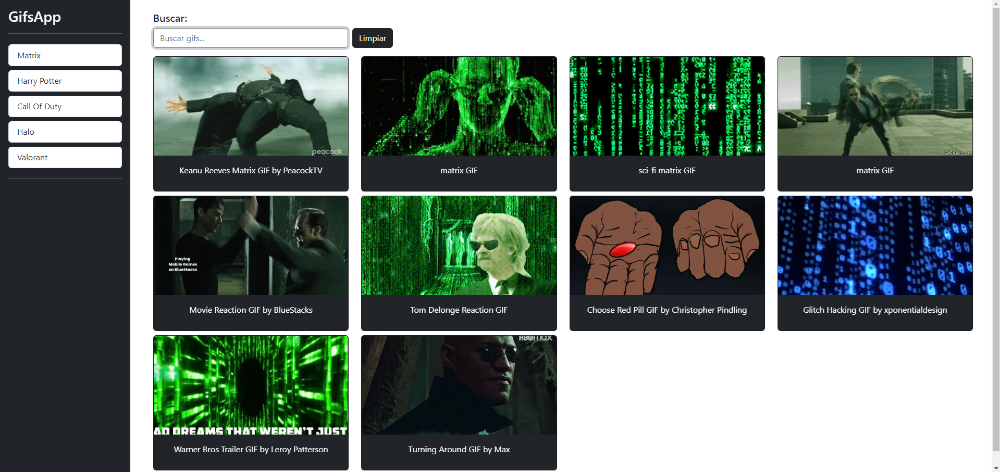

# 🕵️‍♂️ Aplicación de Búsqueda de GIFs en Angular 15.2.0

## 🌟 Características

Esta es una sencilla aplicación en Angular que permite buscar GIFs a través de la API de [Giphy](https://developers.giphy.com/).  
Los GIFs buscados se guardan en un **historial en LocalStorage**, y el usuario tiene la opción de limpiar el historial con un botón dedicado.

### 🚀 Tecnologías utilizadas
- **Angular 15.2.0**
- **Giphy API** para las búsquedas
- **LocalStorage** para guardar el historial
- **Netlify** para el despliegue

### 🖥️ Interfaz


### 🔗 Enlace a la App Desplegada
➡️ [Ver la aplicación en Netlify](https://gifs-application-angular.netlify.app/)

---

## 📦 Instalación y uso

1. Clona este repositorio:
   ```bash
   git clone https://github.com/PagarciaSima/Angular-Gifs-APP
   cd Angular-Gifs-APP
